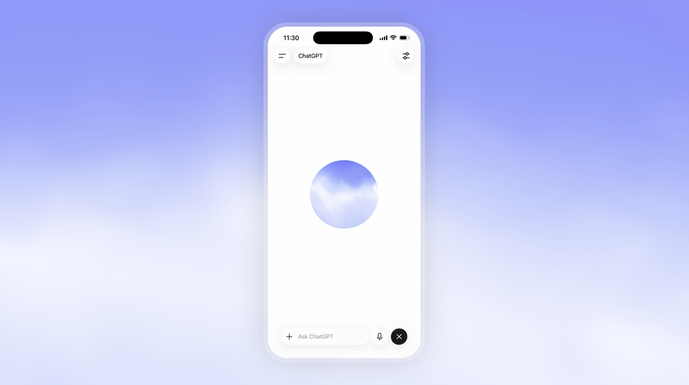

<p align="center">
  
</p>
````bash
cd "/Users/ian/Desktop/开发/openai live orb/open-source/horizon-orb-ui"

cat > README.md <<'EOF'
# OpenAI Live Orb Study
## Preview

<p align="center">
  
</p>
An independent reverse-engineering study of ChatGPT's real-time voice visualizer.

This project explores the rendering architecture, audio-reactive behavior, state transitions, and runtime characteristics of the **Horizon voice orb** used in ChatGPT Voice.

The work includes a standalone UI integration layer and documents a broader research effort involving WebGL runtime inspection, deterministic replay, uniform comparison, and pixel-level parity testing.

> This is an unofficial research project and is not affiliated with, endorsed by, or sponsored by OpenAI.

## Validation Status

| Layer | Status |
| --- | --- |
| Renderer parity | PASS |
| FFT → visual features | PASS |
| Snapshot → uniforms | PASS |
| Sampled pixel parity | PASS — SSIM 1.000 |
| PCM → analyser → FFT | NOT VERIFIED |
| Voice lifecycle parity | PARTIAL |
| Playback / ducking parity | NOT VERIFIED |
| Full end-to-end parity | NOT CLAIMED |

The renderer was validated using captured runtime states. 2,291 captured state frames produced matching final uniforms, and sampled rendered frames reached SSIM 1.000 against their references.

These results validate specific rendering boundaries. They do **not** establish complete behavioral equivalence with ChatGPT Voice.

## What This Repository Contains

This public repository contains the reusable integration layer developed during the study:

- React component API
- Vanilla JavaScript API
- renderer-provider protocol
- audio-level adapter
- lifecycle management
- resize and DPR handling
- reduced-motion handling
- TypeScript definitions
- React and vanilla examples
- regression tests

Recovered proprietary application bundles, research traces, captured user data, and other materials whose redistribution rights are unclear are intentionally excluded.

## Architecture

```text
Application
    |
    +-- state
    +-- audioLevel / AnalyserNode
    +-- size / lifecycle
    |
    v
HorizonOrb
    |
    v
Renderer Protocol
    |
    v
Renderer Provider
    |
    v
WebGL2
````

The public package deliberately separates the application-facing API from the renderer implementation.

## Tech Stack

* TypeScript
* React 18 / 19
* Vanilla DOM API
* WebGL2 renderer protocol
* CSS
* ResizeObserver
* requestAnimationFrame
* Vitest / Node-based regression testing

No Three.js dependency is required by the UI integration layer.

## Installation

Clone the repository:

```bash
git clone https://github.com/iiiiiiiian/openai-live-orb-study.git
cd openai-live-orb-study
npm install
```

Run verification:

```bash
npm run verify
```

## React

```tsx
import { HorizonOrb } from '@horizon-lab/horizon-orb-ui/react';
import '@horizon-lab/horizon-orb-ui/styles.css';

export function App() {
  return (
    <main className="orb-stage">
      <div className="orb-host">
        <HorizonOrb
          assetBaseUrl="/authorized-renderer/"
          state="listening"
          audioLevel={0}
        />
      </div>
    </main>
  );
}
```

## Vanilla JavaScript

```ts
import { createHorizonOrb } from '@horizon-lab/horizon-orb-ui/vanilla';

const orb = createHorizonOrb(host, {
  assetBaseUrl: '/authorized-renderer/',
  state: 'idle',
  size: 300
});

await orb.ready;

orb.update({
  state: 'speaking',
  audioLevel: 0.5
});

orb.dispose();
```

## Public API

### `HorizonOrb`

```ts
interface HorizonOrbProps {
  assetBaseUrl: string | URL;

  state?:
    | 'idle'
    | 'listening'
    | 'thinking'
    | 'speaking'
    | 'disconnected';

  audioLevel?: number;
  audioSource?: AnalyserNode | null;
  size?: number;
  paused?: boolean;
  className?: string;
  onError?: (error: Error) => void;
}
```

### Audio

`audioLevel` accepts a normalized value from `0` to `1` and takes precedence over `audioSource`.

When an `AnalyserNode` is supplied, the integration layer reads time-domain RMS only. It does not acquire microphone permission, modify the caller's audio graph, or dispose of caller-owned audio resources.

### Vanilla Controller

`createHorizonOrb()` returns:

```ts
{
  ready: Promise<void>;
  update(options): void;
  dispose(): void;
}
```

## Renderer Protocol

The renderer is intentionally separated from the public UI integration.

`assetBaseUrl` points to a same-origin renderer provider containing a `frame.html` implementation compatible with the protocol documented in:

[`RENDERER-PROTOCOL.md`](./RENDERER-PROTOCOL.md)

This boundary allows the UI package to remain independent from recovered or otherwise restricted rendering assets.

## Reverse-Engineering Method

The broader study used a deterministic validation pipeline:

```text
Runtime Capture
      |
      v
State / Audio Features
      |
      v
Visual Snapshot
      |
      v
GPU Uniforms
      |
      v
WebGL Renderer
      |
      v
Frame Capture
      |
      v
Pixel Diff / SSIM
```

Additional tooling developed during the research supported:

* WebGL call inspection
* uniform and UBO capture
* runtime event capture
* deterministic trace replay
* frame comparison
* SSIM calculation
* first-divergence diagnostics

The public UI package is the reusable integration result of that research rather than a claim of complete ChatGPT Voice reproduction.

## Known Limitations

* Full PCM → analyser → FFT parity has not been verified.
* Voice lifecycle behavior has only been partially validated.
* Assistant playback and ducking behavior have not been fully reproduced.
* `thinking` currently uses the available idle visual baseline at the integration layer.
* The package does not automatically acquire microphone access.
* WebGL context-loss recovery is the responsibility of the renderer provider.
* Each orb instance currently uses an isolated same-origin iframe for the renderer boundary.
* Full end-to-end behavioral parity with ChatGPT Voice is not claimed.

## Security

The UI sends only renderer state, normalized audio level, logical timing, and viewport information to the configured same-origin renderer provider.

It does not send:

* raw PCM
* raw FFT data
* account information
* recordings
* telemetry to an external service

A renderer provider is trusted application code. Same-origin enforcement should not be treated as a sandbox for untrusted renderers.

## Research and Redistribution

Some materials examined during this study originated from publicly delivered client-side resources.

Recovered shaders, textures, application bundles, runtime traces, and other materials with unresolved redistribution rights are not included in this public repository.

The code in this repository should not be interpreted as OpenAI source code or an official OpenAI implementation.

See [`NOTICE.md`](./NOTICE.md) for additional information.

## Project Status

The visual rendering investigation is considered complete for the verified boundaries listed above.

Further work on full ChatGPT Voice end-to-end parity is intentionally out of scope for this repository.

## Disclaimer

This project is an independent technical study.

OpenAI, ChatGPT, and related names and marks are the property of their respective owners. This repository is not affiliated with OpenAI.

## License

See [`LICENSE`](./LICENSE) and [`NOTICE.md`](./NOTICE.md).

Redistribution status for recovered third-party materials is separate from the licensing status of original code in this repository.
EOF

git add README.md
git commit -m "Rewrite README for public release"
git push

```
```

