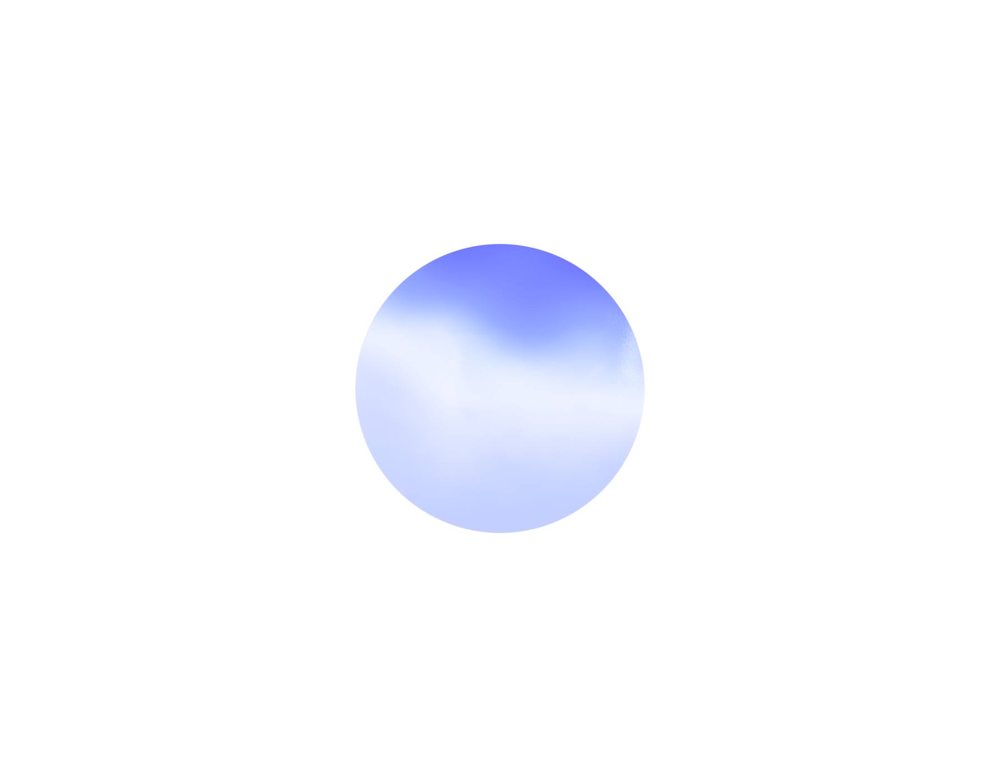

<p align="center">
  
</p>

# OpenAI Live Orb Study

A runnable Horizon Orb visual study with a full WebGL2 renderer, React and vanilla JavaScript adapters, and a local Vite demo.

The demo includes the existing renderer implementation, GLSL shaders, watercolor texture, and state-driven animation. It does not use a Canvas 2D placeholder, CSS gradient, or simplified replacement shader.

This is an independent research project, not an official OpenAI product.

## Preview



The default view is a white background with a centered, responsive orb capped at 300 CSS pixels, in the `listening` state. The image above is a screenshot of the included demo; the live version animates.

## Quick start

Requires Node.js 22.12+ and a browser with WebGL2 support.

```bash
git clone https://github.com/iiiiiiiian/openai-live-orb-study.git
cd openai-live-orb-study
npm install
npm run dev
```

Open [http://localhost:5173/](http://localhost:5173/).

No API key, ChatGPT account, microphone permission, or separate asset download is required. Renderer resources load from the local server. The dev server uses a strict port: if 5173 is occupied, stop the relevant server or run `npm run dev -- --port 5174`.

## Build and verify

```bash
npm run verify
npm run preview
```

Verification runs TypeScript checking, the library and demo builds, and the Node tests. Preview serves the built demo at [http://localhost:4173/](http://localhost:4173/).

- `dist/`: compiled UI library.
- `demo-dist/`: standalone demo, including `authorized-renderer/`. Deploy this entire directory together.
- `npm test`: library tests; run a build first.

For a browser smoke check, leave both dev and preview servers running in separate terminals, then run:

```bash
npx playwright install chromium
npm run smoke
```

The smoke check verifies renderer readiness, WebGL draw calls, changing animation frames, responsive sizing, DPR, browser errors, and failed or external requests. Screenshots are saved under ignored `artifacts/`.

## Included renderer

The visual pipeline is:

```text
React / vanilla host
  → same-origin iframe and frame messages
  → StateAdapter
  → HorizonFrameGenerator
  → WebGL2 interior and composite passes
```

`demo/authorized-renderer/` contains the frame entry point and state adapter. Its `frozen/` directory contains five renderer/dynamics modules, four GLSL shaders, the renderer manifest, and the watercolor texture.

These 14 runtime files were copied without changes from the existing local full-renderer implementation. The frame adapter is the compiled form of that implementation's `frame.ts`; it is not a newly approximated renderer. No original application bundles, browser profiles, account data, audio captures, or research traces are included.

The UI library remains separate from the renderer. `assetBaseUrl` points to a same-origin directory containing `frame.html`; the demo supplies the included provider. See [RENDERER-PROTOCOL.md](./RENDERER-PROTOCOL.md).

## Vanilla JavaScript

Within this repository, Vite can import the adapter directly:

```ts
import {createHorizonOrb} from './src/vanilla';

const orb = createHorizonOrb(document.querySelector('#orb')!, {
  assetBaseUrl: '/authorized-renderer/',
  state: 'listening',
  audioLevel: 0,
  size: 300,
});

await orb.ready;
orb.update({state: 'speaking', audioLevel: 0.5});

// On teardown:
orb.dispose();
```

For another application, copy the renderer directory to its same-origin static assets and integrate the UI sources or locally built package. The package is not published to npm.

## React

```tsx
import {HorizonOrb} from './src/index';

export function App() {
  return (
    <HorizonOrb
      assetBaseUrl="/authorized-renderer/"
      state="listening"
      audioLevel={0}
      size={300}
      onError={console.error}
    />
  );
}
```

The renderer directory must be served at the URL above. The React component and vanilla controller use the same iframe protocol.

## State and audio

Supported state inputs are `idle`, `listening`, `thinking`, `speaking`, and `disconnected`. The current state adapter maps `thinking` to the idle visual baseline.

`audioLevel` accepts a value from 0 to 1 and takes precedence over `audioSource`. Alternatively, pass a caller-owned `AnalyserNode`; the adapter reads time-domain RMS without opening a microphone or changing the audio graph.

Other options include `size`, `paused`, `className`, and `onError`. When size is omitted, the host container controls layout. The UI handles resizing, DPR, reduced motion, and teardown. The caller owns audio resources; the renderer owns GPU resources.

## Verification scope and limitations

The local dev and production-preview builds were checked in Chromium: the renderer reported ready, WebGL2 draw calls ran, successive screenshots changed, and responsive/DPR dimensions matched. No browser errors, missing resources, or external asset requests were observed.

These checks establish that the included visual renderer runs. They do not establish complete behavioral equivalence with ChatGPT Voice. This project does not include a voice backend, microphone capture flow, full PCM/FFT pipeline, assistant playback, or ducking. WebGL context-loss recovery is not implemented.

Frame messages contain visual state, a scalar audio level, logical time, viewport dimensions, and reduced-motion preference. A same-origin renderer is trusted application code, not an untrusted-code sandbox.

## License and provenance

Project-authored code is available under the [MIT license](./LICENSE). Third-party-derived renderer materials, shaders, textures, and reference imagery are **not** covered by that MIT grant; their original rights remain with their respective owners. Public availability does not itself establish permission to reuse those materials.

See [NOTICE.md](./NOTICE.md) for the file-level scope and provenance. OpenAI and ChatGPT names and marks belong to their respective owners. This project is not affiliated with or endorsed by OpenAI.
